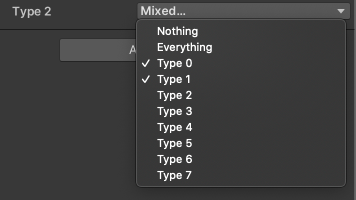
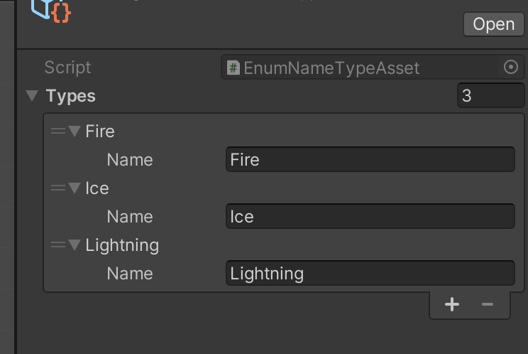
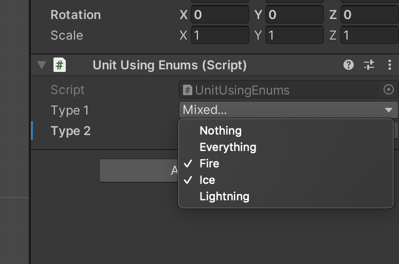
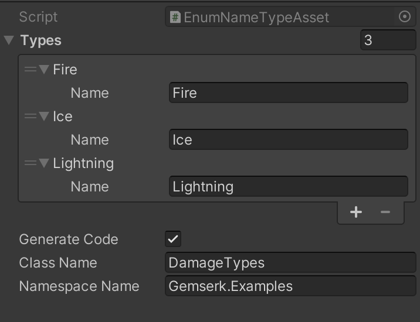
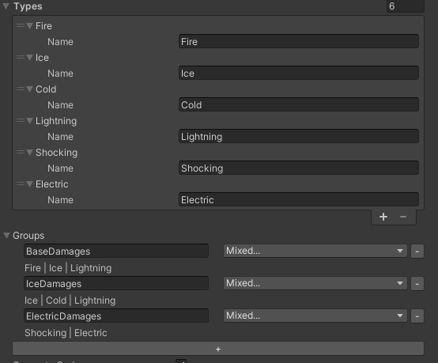
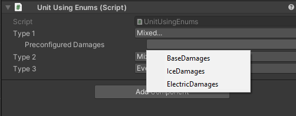
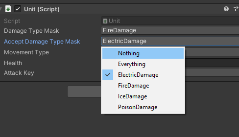

[](https://openupm.com/packages/com.gemserk.bitmasktypes/)

The idea with this project is having a way of creating custom enums in editor, by Game Designers for example, and use them internally for fast comparisons as bitmasks.

## Motivation

When working on Iron Marines at Ironhide, we used bitmasks to speed up units' abilities targeting logic. To do that, we were using c# Enums with Flags Attribute, like this:

```csharp
[Flags]
public enum TargetType
{
    Unit = 1 << 0,
    Structure = 1 << 1,
    Vehicle = 1 << 2
}
```

Using this approach, we can configure them in Unity's Editor by selecting the flags we want, and then we just compare using bitwise operations to check if a target matches the ability targeting. 

This works pretty well internally but it has one limitation, it is not so easy for the Game Designers to extend it since they have to know it is used internally as bitmask and they don't care about it.

There is also another problem, extending it by code couples the Enum definition to a specific game instead of keeping the core engine decoupled to be easily reused.

So the focus here is to keep the base concepts coupled to the core engine while leaving the values to the Game Designers, and if they want, different on each game.

## Main approach: custom property to override maskfield names

The main option is to just define your types in a generic way in your code and then use property attribute to override the names shown in the inspector. This is a clean an simpler way.

For example, for the following enum:

```csharp
[Flags]
public enum DamageType
{
    Nothing = 0,
    Everything = -1,
    Type0 = 1 << 0,
    Type1 = 1 << 1,
    Type2 = 1 << 2,
    Type3 = 1 << 3,
    Type4 = 1 << 4,
    Type5 = 1 << 5,
    Type6 = 1 << 6,
    Type7 = 1 << 7
}
```

Will be draw in the inspector as:



In this case, by creating an `EnumNameTypeAsset` asset as it follow:



And then, configuring a field attribute:

```csharp
[EnumName("damages")]
public DamageType type1;
```

Then, the inspector will show this:



One good thing about enums approach is you can have type checks in compilation time, so you can't misplace a check between ArmorType and DamageType unless you want it and you have to explicitly do it by casting to the other enum.

### Using it with int fields

This approach can be used with int fields too:

```csharp
[EnumName("damages")]
public int type3;
```

One good thing of using ints is you don't have to worry about defining all the enum entries, while the enums mode will fail if you define more types in the asset than the enum. 

One drawback is you don't have any type in code, you just work with ints, so you delegate the config to the editor all the time. 

### BitMask Attribute

Another approach is to use a generic BitMask attribute to let you select a bitmask in editor while still using ints (or similar) in code.

```csharp
[BitMask]
public int type1;

[BitMask(32)]
public int type2;
```

The first one allows selecting a bitmask of 8 bits while the second can select from 32 bits.

### Code generation

In the case of using ints, there is an option to generate class with static int fields with each value, so for the previous example, activating the code generation as it follows:



Will generate something like this:

```csharp
namespace Gemserk.Examples
{
    public class DamageTypes
    {
        public static int Fire = 1 << 0;
        public static int Ice = 1 << 1;
        public static int Lightning = 1 << 2;
    }
}
```

Which helps a lot if you need to check for specific value directly in code.

### Preconfigured bit masks

There is also an option of preconfigure some bit masks for some groups of types, for example, all cold related damages, like Ice, Cold, Frost, etc. In order to do that, you can do the following:



This will allow you to select from a list these preconfigured values:



And by doing so, it will override the serialized value with the bit mask, and it will also auto generate the following code inside the previous autogenerated code:

```csharp
namespace Gemserk.Examples
{
    public class DamageTypes
    {
        public static int Fire = 1 << 0;
        public static int Ice = 1 << 1;
        public static int Cold = 1 << 2;
        public static int Lightning = 1 << 3;
        public static int Shocking = 1 << 4;
        public static int Electric = 1 << 5;
        
        public static int BaseDamages = Fire | Ice | Lightning;        
        public static int IceDamages = Ice | Cold | Lightning;
        public static int ElectricDamages = Shocking | Electric;
    }
}

```

## Another approach is using Unity assets directly in code (deprecated)

Right now, each time a new type is created, the asset importer auto assigns a bitmask to that asset. The bitmask itself isn't important in editor, could change and nothing happens since the users of that asset should referencing the asset itself. 

To use it, you have to create a subclass of BaseTypeAsset and start creating your asset instances for each kind of type you need. For example, for a game with different kind of damages:

```csharp
[CreateAssetMenu(menuName="Gemserk/Example/Damage Type")]
public class DamageTypeAsset : BaseTypeAsset {}
```

Then, in a class you want a bitmask of that type, you can do the following:

```csharp
public class UnitWithDamage : MonoBehaviour
{
    [TypeMask(typeof(DamageTypeAsset))]
    public BaseTypeMask damageTypes;
}
```

Here you declare a field of type BaseTypeMask, and say the type you want is of type `DamageTypeAsset` so the custom property drawer will allow you select the bits you want using an enum mask (internally saves a list of asset references, not the bitmask).

In editor, it looks like this:



### Code autogeneration

For each custom type, a file with an enum with bitmasks is autogenerated when reimporting new type instances, for example: 

```csharp
namespace Gemserk.Examples
{
    public enum DamageTypeAssetEnum
    {       
        ElectricDamage = 1 << 0,   
        FireDamage = 1 << 1,
        IceDamage = 1 << 2,
        PoisonDamage = 1 << 3,
    }
}

```

So this can be used from code directly. This normally isn't needed since we try to configure everything to depend on assets and then use an int, but sometimes this could be handy, maybe for unit tests, or for editor stuff.

The drawbacks of this approach is we have to depend a lot on Unity assets in code, and also having the iteration to calculate the bitmask.